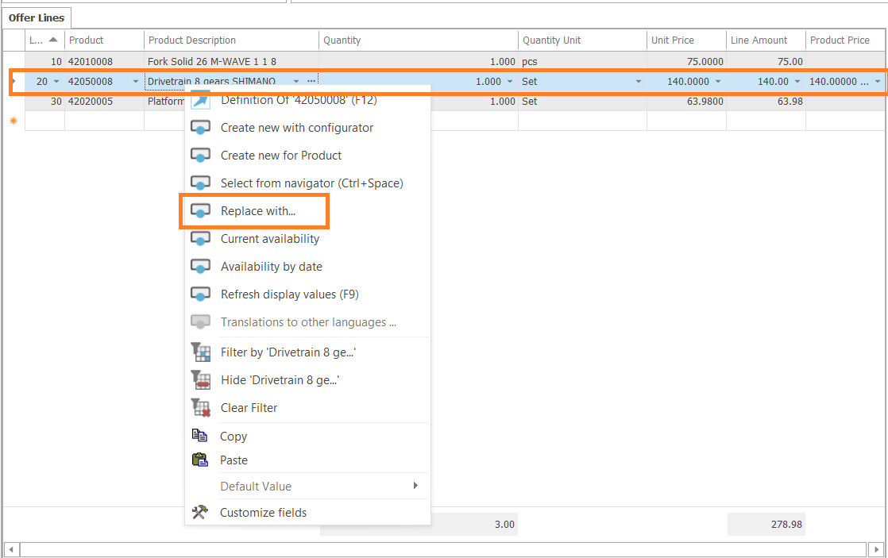
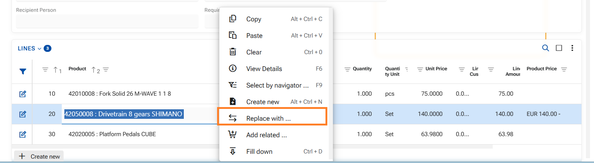
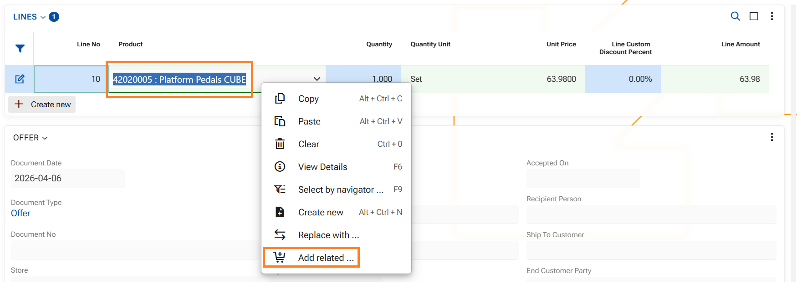

# Product Management
The **Product Management** module is the heart of product data management — where all products are defined, structured, and connected within the system.
Its purpose is to ensure complete, accurate, and consistent product information throughout the entire lifecycle — from definition and maintenance to sales, service, and analytics.

## Notable features

### Introduction of a new entity ["Product Relations"](product-relations/index.md)

With the latest update, we’re introducing a new concept: _Product Relations_, bringing more flexibility, clarity, and automation to the way products are connected.
This functionality is implemented through two new tables:

🧩 Product Relation Types – define what kind of relationship exists between products (e.g., Replacement, Fitment, Merchandising). 
🔗 Product Relations – store the actual links between products (from → to), including validity dates and quantity factors.

This brings to the table new features and functions too.

## Other features

### 1. Replace a product

ERP.net allows you to replace one product in a document line with another product that has been defined as a valid Replacement in the Product Relations framework. 
The function is called **"Replace with..."** and is available in both the Web Client and the Desktop Client. 
It helps users select approved substitute products without searching manually and ensures that only currently valid replacements are offered.

Learn how to use it [HERE](https://docs.erp.net/tech/modules/general/products/how-to/replace-with.html).

Desktop client:

WEB client:

### 2. Add a related product

Another way to increase the value of an offer or sale is by adding a related product to the base product.

The ERP.net Web Client introduces the **Add related** functionality, which utilizes product relations of system type Merchandising. This allows users to easily offer and sell complementary products that are typically purchased together or enhance the main product. Unlike product replacement, this function does not substitute the base product. Instead, it adds a new document line with the selected related product.

Learn how to use it [HERE](https://docs.erp.net/tech/modules/general/products/how-to/add-related.html)
