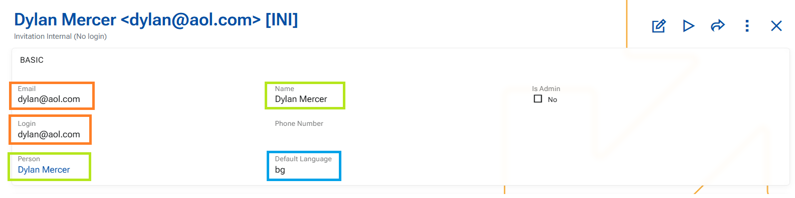

# Security 

## Notable features

## Other features

### 1. System tweaks at User creation
Through a series of [business rules](https://docs.erp.net/model/entities/Systems.Security.Users.html#business-rules) we have introduced several improvements in **user creation and maintenance** to streamline data entry and ensure consistent defaults.

These changes aim to:
- reduce manual input  
- improve consistency  
- provide sensible defaults while preserving user control  

➡️ Email → Login auto-fill 
When **Email** is populated, the **Login** field is automatically filled with the same value.
- This applies only if **Login is empty**.
- Once a value exists in Login, it is **not affected** by further changes to Email.

➡️ Person → Name synchronization  
When a **Person** is selected, the **Name** field is automatically populated.
- If Person is changed → **Name is updated accordingly**.
- If Person is cleared → **Name is also cleared** (and validation will require it again on save).

➡️ Default Language initialization (R39700-3) -This rule applies **only on insert** 
On **user creation**, `DefaultLanguage` is automatically set:
  - First from the **system configuration (Default language)**.
  - If not defined → from the **current language of the user creating the record**.
  - If `DefaultLanguage` is later cleared, it is **not re-populated automatically**. In this case, the system uses **English as an implicit fallback**.

### 2. Different single-form layouts per User Type

ERP.net now supports different single-form layouts for Users based on User Type. This means administrators with layout administration permissions can configure the User form differently for each user type, and save those layouts for shared use. Once saved, the appropriate layout is applied when working with users of the same type.

This makes it easier to present only the fields and sections that are relevant for each type of user, without one layout affecting all others.

This enhancement also establishes the same principle for scenarios where the layout category is based on a system-defined enum value.

VS

