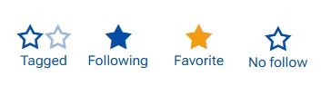

# Social Interaction

The **Social Interaction** framework in ERP.net brings team collaboration to life through three core components — Social Groups, the Discussions/Chat panel, and Notifications. 
 **Social Groups** provide a centralized space for teams to collaborate, share updates, and manage discussions, forming the foundation of the platform’s Social ERP concept. 
 Тhe integrated **Chat** component enables real-time communication within groups, while **Notifications** keep users informed and engaged with relevant activities. 
 Together, these tools create a connected, efficient, and adaptive collaboration environment for organizations of any size or industry.

## ⚠️ Breaking Changes 
### Breaking Change: Follow Levels and Notification Behavior

Notifications now depend on the Follow Level of objects. All existing follows have been migrated to TAGGED.
 TAGGED objects deliver chat/comment events only.
 ➡️ To continue receiving update or implicit notifications, mark important objects as Follow or Favorite.
>[IN DETAILS](../breaking-changes/follows-and-notifications.md)

## Notable features

### **1. Introducing Follow levels for clearer Favorites and smarter Notifications**

We’ve improved how following works in Social Interaction by introducing [Follow levels](https://docs.erp.net/webclient/introduction/social/social-follows.html) — a new way to better reflect why you follow an object and how important it is to you.

Until now, following was a simple on/off action. This often mixed together objects you were automatically involved in (for example, through mentions or assignments) with objects you truly cared about. Follow levels change that.

With this update:

- Objects can be followed at different levels, depending on your intent.
- Favorites are now an explicit choice, reserved only for objects you mark as most important.
- Automatic follows (such as mentions) no longer fill up your Favorites.
- Notifications organized in classes are better aligned with what actually matters to you and created if follow level allows.

As part of this change, existing follows were migrated to an automatic follow level (a Breaking change). This means your Favorites list may initially be empty until you mark objects as Favorite again — helping you start fresh with a more meaningful set.

 **Follow levels at a glance**

Each followed object now has a follow level that shows why you are following it and how important it is to you.
Follow levels are personal — different users can follow the same object at different levels.

- *Tagged*: An automatic follow. You are tagged when the system involves you, such as through mentions or assignments.
- *Following*: An explicit follow. You choose to follow the object to stay informed, without marking it as important.
- *Favorite*:The highest level. You mark the object as important, and it appears in the Favorites app.

Follow levels are stored per user and per object, representing your personal relationship to what you follow and validating corresponding Notifications for you!

## Other features

### **1. Gallery of uploaded files**

We’ve added a new Preview option to the Files tab in Social Groups! 🎉
Now, when you select Preview from the file menu, the file opens in a pop-up window, and below it you’ll see a handy gallery of all uploaded files with thumbnails. 

This makes it easier to quickly browse and view shared content without downloading each file — perfect for fast collaboration and visual overview.

   

### **2. System comment when a Case is assigned**

In our effort to strengthen teamwork and ensure clear announcements, we’ve added a new rule: when a Case is assigned to a group, a system comment and the corresponding notification are automatically generated. This keeps the Case visible to all members and ensures nothing important is missed.

