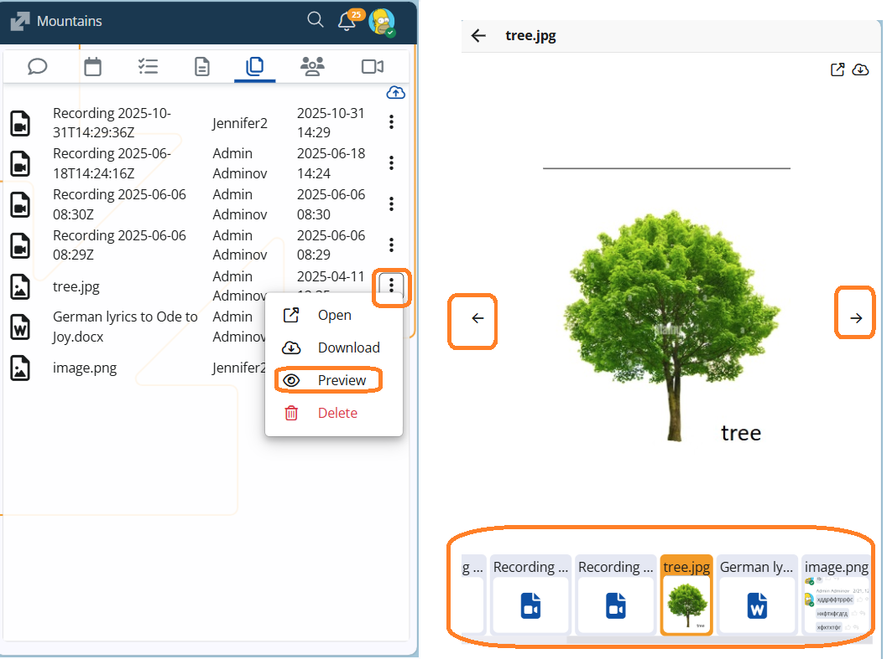
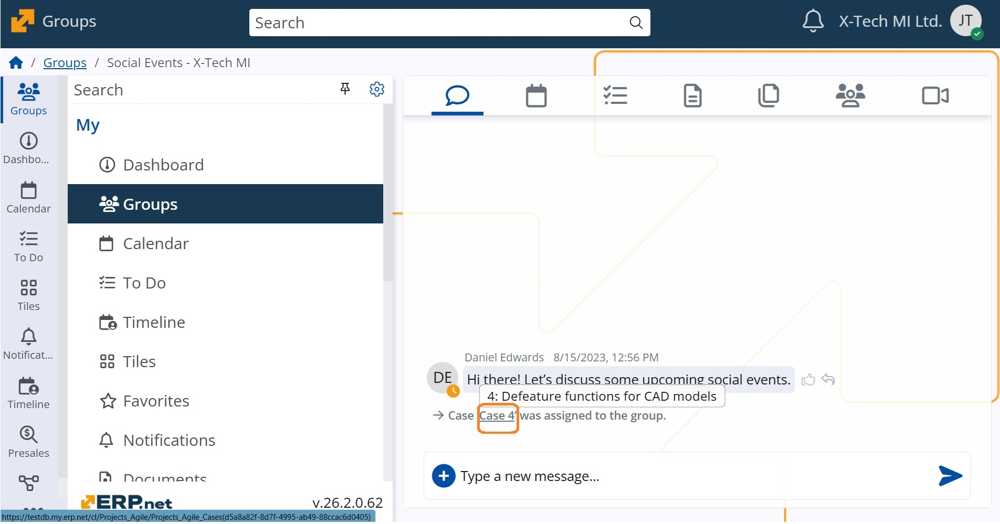

# Social Interaction

The **Social Interaction** framework in ERP.net brings team collaboration to life through three core components — Social Groups, the Discussions/Chat panel, and Notifications. 

**Social Groups** provide a centralized space for teams to collaborate, share updates, and manage discussions, forming the foundation of the platform’s Social ERP concept. 

Тhe integrated **Chat** component enables real-time communication within groups, while **Notifications** keep users informed and engaged with relevant activities. 

Together, these tools create a connected, efficient, and adaptive collaboration environment for organizations of any size or industry.

## Notable features

## Other features

### **1. Gallery of uploaded files**

We’ve added a new Preview option to the Files tab in Social Groups! 🎉

Now, when you select Preview from the file menu, the file opens in a pop-up window, and below it you’ll see a handy gallery of all uploaded files with thumbnails. 

This makes it easier to quickly browse and view shared content without downloading each file — perfect for fast collaboration and visual overview.
   

### **2. System comment When a Case is assigned**

In our effort to strengthen teamwork and ensure clear announcements, we’ve added a new rule: when a Case is assigned to a group, a system comment and the corresponding notification are automatically generated. This keeps the Case visible to all members and ensures nothing important is missed.

