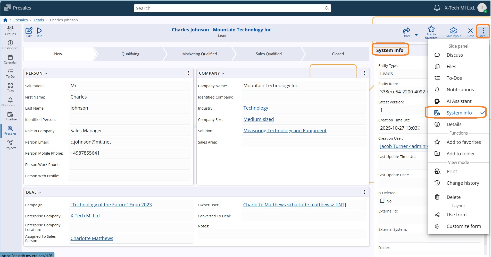
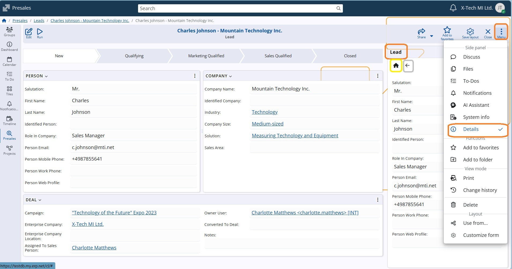

# WEB client v.26.2
### Notable features
[Editable navigators](https://support.erp.net/hc/en-us/articles/21204475157276-WEB-client-Inline-%D0%B5diting-in-Navigators-v-26)

### Other features
**1. New System-Calculated Attributes: “Total Line Amount” and “Amount To Pay”**

Our latest update introduces two powerful system-calculated attributes — “Total Line Amount” and “Amount To Pay” — for all Invoice and Sales documents.
With these new fields, users can instantly view key financial figures directly within the document form or navigator, without needing to perform any manual calculations.
This improvement streamlines financial verification, enhances accuracy, and saves valuable time when managing transactions — helping you stay focused on what matters most: running your business efficiently.

**2. Access to object system information**

System information provides special data for the currently observed object, as its ID for example. It is now easier to access that through the menu, as a side panel System info..

**3. Additional support by the Details panel**

The Details panel, one of the most frequently used sources of information, has been improved to offer enhanced support when viewing a record.
Now displayed as a side panel, it shows all the details of the currently opened record — information that was previously only accessible while browsing through the navigator rows.
You can now customize the panel to display any fields you choose, not just the default ones.
Additionally, if you navigate to another definition within the record, you can easily return to the main record details by clicking the Home icon.

