# WEB Client
The @@webclientfull is the web-based user interface of the ERP.net business-management platform. It is one of the primary ways to access and interact with all the modules inside the ERP.net system—such as CRM, financials, inventory, production and more.

## Notable features

## Other features

### 1. New System-Calculated Attributes: “Total Line Amount” and “Amount To Pay

Our latest update introduces two powerful system-calculated attributes — “Total Line Amount” and “Amount To Pay” — for all Invoice and Sales documents.

With these new fields, users can instantly view key financial figures directly within the document form or navigator, without needing to perform any manual calculations.

This improvement streamlines financial verification, enhances accuracy, and saves valuable time when managing transactions — helping you stay focused on what matters most: running your business efficiently.
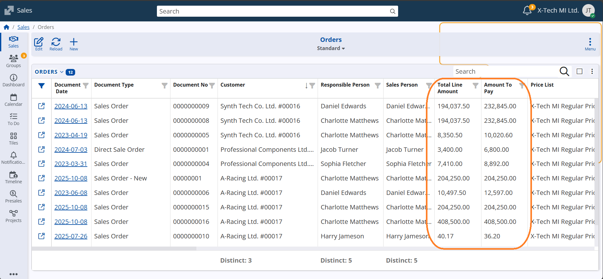
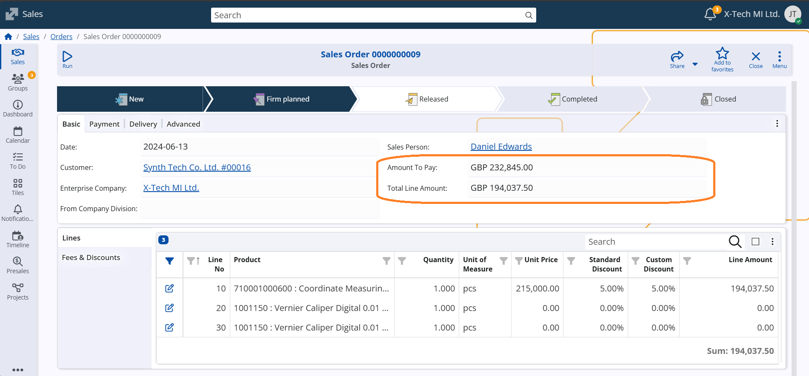

### 2. Access to object system information

System information provides special data for the currently observed object, as its ID for example. It is now easier to access that through the menu, as a side panel System info.
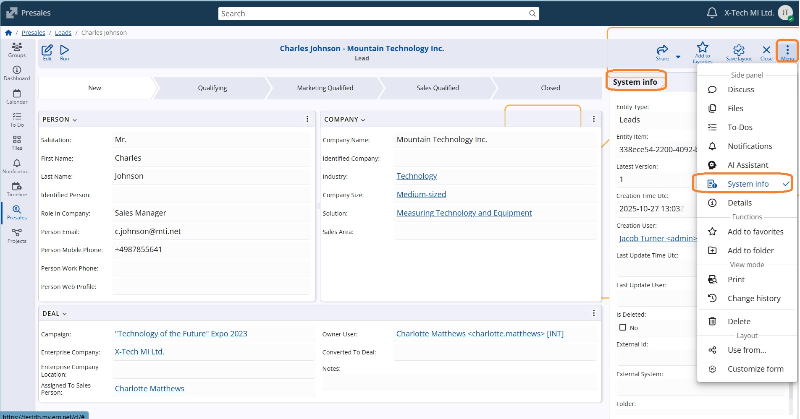

### 3. Additional support by the Details panel

The Details panel, one of the most frequently used sources of information, has been improved to offer enhanced support when viewing a record.

Now displayed as a side panel, it shows all the details of the currently opened record — information that was previously only accessible while browsing through the navigator rows.

You can now customize the panel to display any fields you choose, not just the default ones. Additionally, if you navigate to another definition within the record, you can easily return to the main record details by clicking the Home icon.
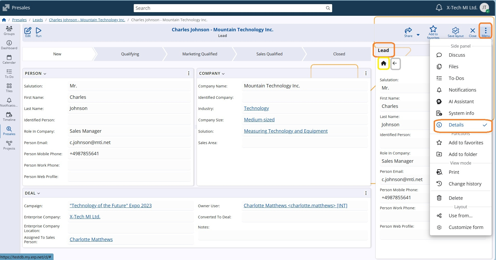

### 4. New time-saver in Line Panels - add multiple lines from Navigator

The next feature serves those who work with line panels like Order Lines, Offer Lines, and others!

Until now, when you needed to fill in a line field with option _Right-click/Select by navigator_ (eg.insert a Product), the Navigator allowed you to select and insert just one item in the single line at a time. That meant repeating the process for each new line. With the latest update, you can now select multiple items in one go! 

Simply use the _Select by navigator_ option.  
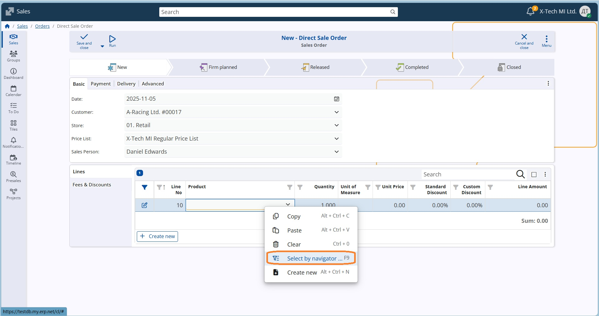

In the opened navigator swich-on  option _Select Multiple_ (optional) and mark all the products you need.
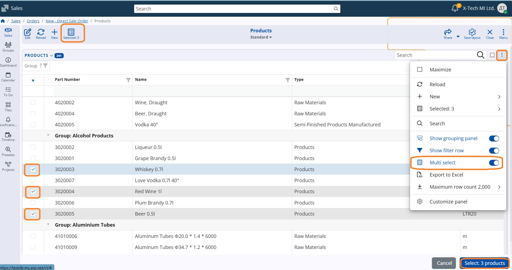

Once you confirm, each selected product will be automatically added as a separate line.
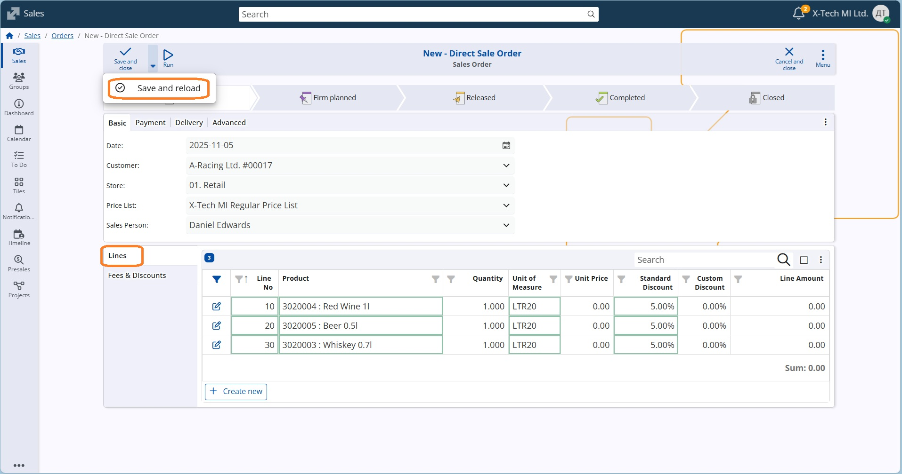

Continue in the same way and save the new document.

> [!CAUTION]
> If you edit an existing middle line, bear in mind that all selected items will REPLACE the next lines. The selection will not be inserted between the existing lines.

💡 Why it’s great:
- Saves you time and clicks when adding multiple products.
- Makes creating sales orders and offers much faster and smoother.
- Keeps your focus on your work — not on repetitive line editing.

Try it out next time you’re adding several products — you’ll feel the difference right away!

### 5. Updated Save & Close experience

We’ve refined the form command buttons to make saving and closing more predictable, consistent, and harder to do by accident—especially when working fast.

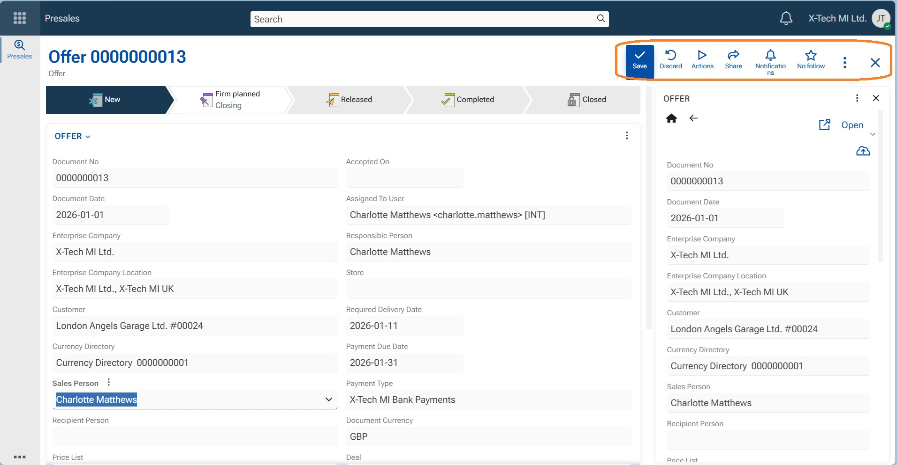

✨ When you press button **Save**
-  saves your current changes to the database **and keeps the form open**.
-  if nothing has changed, **Save** is disabled.

✨ When you press button **Close**
 Closes the form and returns to the page, where you opened it from (e.g. the navigator).
 If you you attempt to close with pending changes, you’ll be prompted to choose whether to:
  - **Save changes**, or
  - **Discard changes**, or
  - **Cancel** (stay on the form)

⚙️ The above choice is delivered together with a new config key, under #71 [/WebClient/AlwaysSaveOnClose](https://docs.erp.net/tech/reference/config-options-reference.html#71-webclientalwayssaveonclose): "Always save automatically when closing"
 Once selected -Toggle switch ON/OFF- the system remembers your choice for future closes. If you want to change this later, the setting is available in Settings tab (Customize panel menu).

✨ When you press button **Discard**
  The unsaved changes will be reverted and you will stay in view mode on the form.

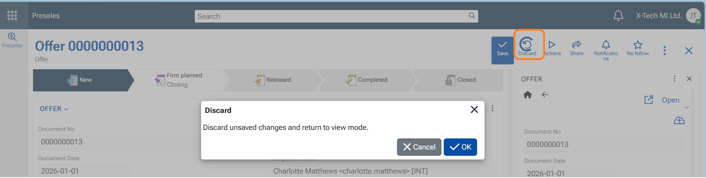

✨ Behaviour of Save in subforms
  A Subform is a form, that you reached from another form. So this form usually has a return address. You can edit it, but the system needs to know what to do next. So button Save appears in two options - "Save and close" (to take you back to the initial form) and "Save and reload" (to stay in the current form).

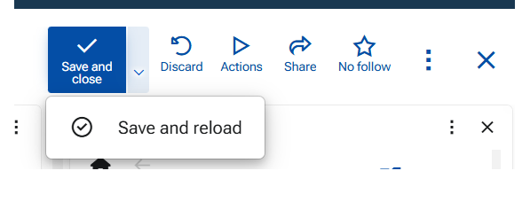

✨ Small-screen improvements
  On narrower screens (e.g., tablet widths), secondary commands such as "Share", "Notifications", and "Favorites" may move into the **“…”** (form menu) to keep primary actions accessible.

Learn how to use these buttons from the dedicated page [Command buttons](https://docs.erp.net/webclient/commands/buttons.html#save)

### 6. Search Enterprise Company and Company Location in the profile menu

Search in Enterprise Company and Company Location is designed to help users quickly find the right company when working with a large number of records. The search field automatically appears when the number of records exceeds 20. Users can enter a search string to instantly narrow down the list. Only matching companies are displayed, making selection faster, easier, and less error-prone.

Use the arrow keys to navigate to the desired result and press Enter, or click with the mouse to confirm the selection.

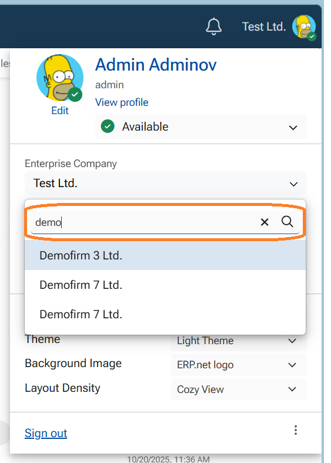

### 7. A modernized look  - same functionality, better experience

The goal is simple: less visual noise, better focus, and a more contemporary UI/UX experience—without changing the way you work.This modernization focuses entirely on visual clarity and usability. All existing functionality remains intact—now presented in a cleaner, more modern way that supports long work sessions and complex data entry.

The updated design makes everyday work lighter on the eyes, easier to scan, and more consistent across the application.

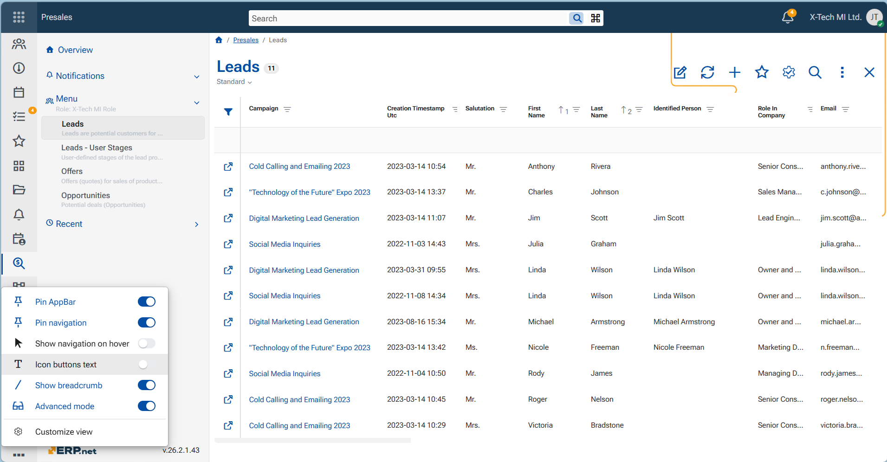

✅ **Cleaner, borderless layout** - Panels and UI sections no longer rely on heavy frames. The interface feels more open, structured, and calm. 
✅ **Clearer hierarchy and typography** - Entity titles are more prominent, secondary information is visually de-emphasized, and modern fonts are introduced for better readability and consistency. 
✅ **Refined headers and actions** - Actions in the header are aligned and visually unified, making key operations easier to find and faster to access. 
✅ **Advanced UI Mode** - A new Advanced Mode setting lets experienced users see additional UI controls, while keeping the default interface clean and minimal for everyday work. 
✅ **Smarter field layout** - Fields now vary in width based on content, labels are clearly separated from values, and spacing is improved to support faster scanning. 
✅ **Subtle interaction cues** - Hover highlights and contextual icons appear only when relevant—guiding attention without cluttering the screen. 
✅ **Improved navigation context** - Breadcrumbs are now clearly positioned above the form, helping users stay oriented within the application. 

 
The **Start** button icon has been updated. The ERP.net arrows logo is no longer used for the **All apps** action, since the logo represents brand identity, while the action represents global application navigation. Separating these meanings improves semantic clarity in the interface.

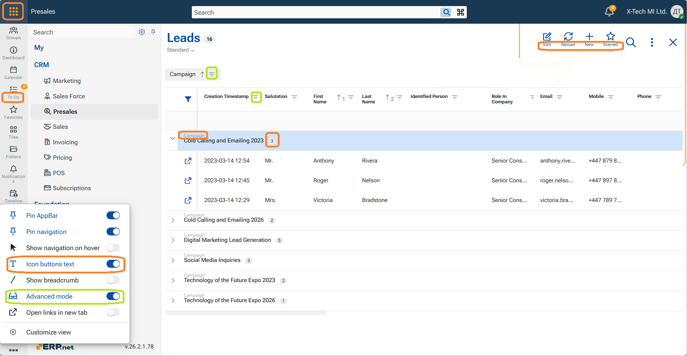

**Default App-bar settings for new users**

For new users (first login in a database or on a new device), the following App-bar settings are applied by default. These defaults are chosen to provide a clean and distraction-free starting interface for new users. Additional controls and navigation options can be enabled as needed, allowing each user to gradually adapt the interface to their preferred way of working - a “clean by default, power when needed” philosophy:

- **Pin AppBar** — On  
- **Pin navigation** — Off  
- **Show navigation on hover** — Off  
- **Icon buttons text** — Off  
- **Show breadcrumb** — Off  
- **Advanced mode** — Off  
- **Open links in new tab** - Off
  
We believe this update makes the Web Client feel not only more modern, but also more comfortable and intuitive to use—today and going forward.

How to utilize the [layouts and views](https://docs.erp.net/webclient/layouts-and-views/index.html) in WEB Client is explained in the dedicated help articles (follow link). 

### 8. AI-assisted translations

Managing multilingual data just became easier.Until now, when a field wasn’t translated, users often saw a transliterated value when switching work languages—something that frequently caused confusion and required manual re-translation.

The Web Client now offers AI-assisted translation for multilingual fields.

When a value exists in one language, that language becomes the source, and the system can automatically translate the value into the other active languages that don’t yet have translations.

Users can choose how to handle missing translations:

- Translate the value automatically
- Transliterate the original text
- Copy the value from the source language

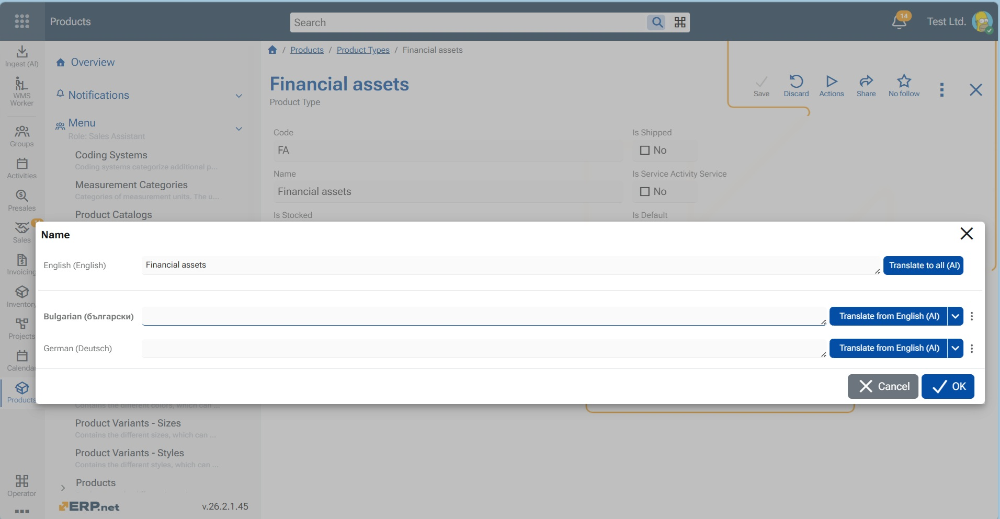

This removes friction, saves time, and makes working in multilingual environments more intuitive—while keeping users fully in control. Learn how to exploit this feature from the dedicated article [Translate multilanguage fields](https://docs.erp.net/webclient/introduction/how-to/translate-fields.html)

### 9. Open links in a new browser tab

We’ve added a new toggle option in the App-bar menu: "Open links in new tab".

When enabled, records that open in full view will launch in a new browser tab, so you don’t lose your current page. This makes it easier to review related information while continuing your work uninterrupted.

Currently, this behavior applies to:

👉 Links in received notifications (clicking a notification opens the target record) 
👉 Links in navigators (the first column link that opens a record) 
👉 Links in chat (e.g., links to objects in system comments or shared items) 

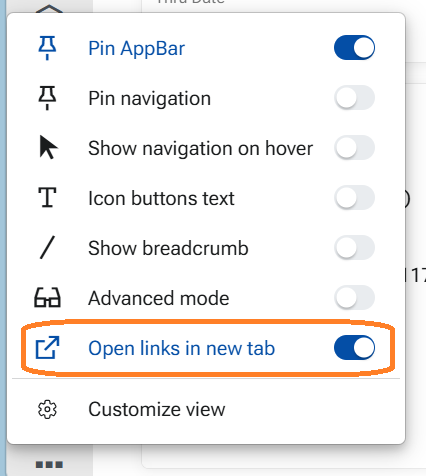

### 10. Double-Click to enter form Edit mode

Simply **hover over a field and double-click it** to begin editing — making the workflow faster and more natural. No need to use the **Edit** button anymore.

- Hovering over the fields makes them become light grey. Thus you know which the sensitive area is.
- Double-click in a field to enter form Edit Mode and the same field will automatically receive **focus**.
- Double-clicking a grid row does nothing, but when this row is opened in the side panel, the function works from within it the same way.

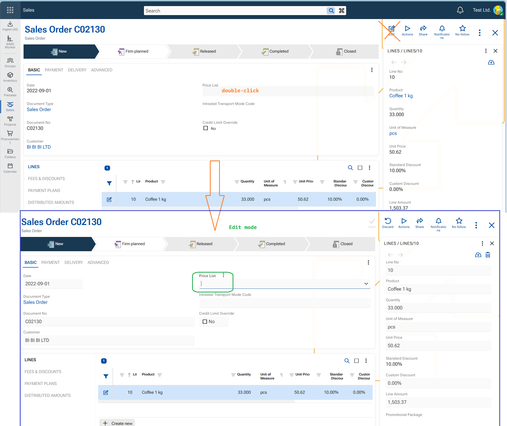

### 11. Bulk Fill down of a cell value

You can now use [Fill Down (Ctrl+D)]([link to how to use it](https://docs.erp.net/webclient/navigators/guide/fill-down.html)) to quickly copy a value down through selected rows in the same column (follow link for instructions).
This makes mass editing in grid views much faster, especially when maintaining definitions, lists, and other tabular data.

The option applies only to editable rows and cells in Navigators and Row-panels as well.

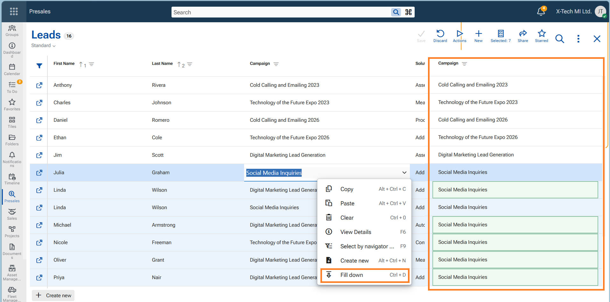

### 12. Know your time

Date and time fields stored in UTC are now shown in your local browser time by default. 
You can still see the original UTC value on hover. Users do not need to change anything. With this approach, it has been achieved: 

👉 Easier reading of event times without manual timezone conversion 
👉 Fewer mistakes when interpreting timestamps across different time zones 
👉 Faster work in lists, forms, and navigators where time-based fields are used 
👉 Better user experience with information presented in the context most relevant to each user

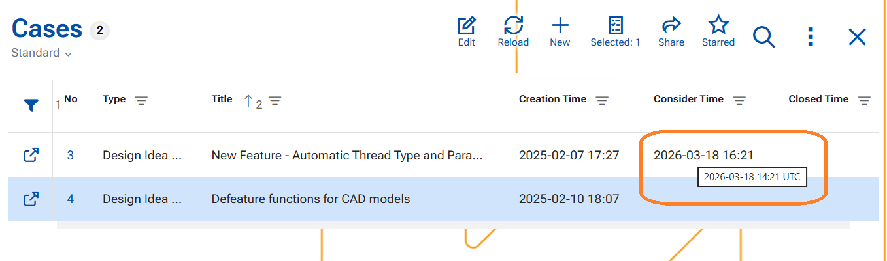

### 13. Product replacement with ["Replace with..."](https://docs.erp.net/tech/whats-new/v26-2/product-management/index.html)

ERP.net allows you to replace one product in a document line with another product that has been defined as a valid Replacement in the Product Relations framework. 
Learn more from the link above.

### 14. Context-aware Timeline widget in forms

In v.26.2, the [Timeline](https://docs.erp.net/webclient/introduction/my-apps/timeline.html) app can now be shown directly inside supported forms as a [widget panel](https://docs.erp.net/webclient/introduction/my-apps/index.html#widgets), so users can review related activities and documents without leaving the current record.

This makes it easier to follow the history around a customer, supplier, person, lead, opportunity, or document while staying in context. Instead of switching to a separate screen and then filtering again, users can open a form and immediately see the related timeline there.

The widget follows the record that is currently open in the form. When the user opens another record, the timeline refreshes and shows the relevant context for that record.

The embedded Timeline also keeps the familiar navigation experience. Users can move through time, return to **Today**, switch between **Day**, **Month**, and **Quarter**, and use the date picker directly inside the form.

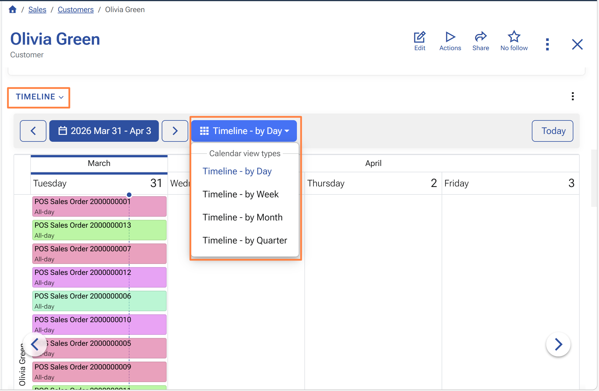
