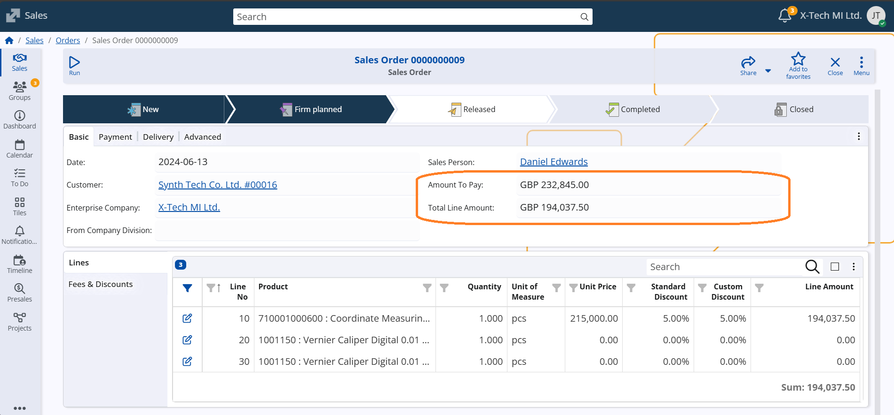

# WEB Client

The ERP.net Web Client is the web-based user interface of the ERP.net business-management platform. It is one of the primary ways to access and interact with all the modules inside the ERP.net system—such as CRM, financials, inventory, production and more.

## Notable features

## Other features

### **1. New System-Calculated Attributes: “Total Line Amount” and “Amount To Pay”**

Our latest update introduces two powerful system-calculated attributes — “Total Line Amount” and “Amount To Pay” — for all Invoice and Sales documents.

With these new fields, users can instantly view key financial figures directly within the document form or navigator, without needing to perform any manual calculations.

This improvement streamlines financial verification, enhances accuracy, and saves valuable time when managing transactions — helping you stay focused on what matters most: running your business efficiently.

### **2. Access to object system information**

System information provides special data for the currently observed object, as its ID for example. It is now easier to access that through the menu, as a side panel System info.

### **3. Additional support by the Details panel**

The Details panel, one of the most frequently used sources of information, has been improved to offer enhanced support when viewing a record.

Now displayed as a side panel, it shows all the details of the currently opened record — information that was previously only accessible while browsing through the navigator rows.

You can now customize the panel to display any fields you choose, not just the default ones. Additionally, if you navigate to another definition within the record, you can easily return to the main record details by clicking the Home icon.

### **4. New time-saver in Line Panels - add multiple lines from Navigator**

The next feature serves those who work with line panels like Order Lines, Offer Lines, and others!

Until now, when you needed to fill in a line field with option _Right-click/Select by navigator_ (eg.insert a Product), the Navigator allowed you to select and insert just one item in the single line at a time. That meant repeating the process for each new line. With the latest update, you can now select multiple items in one go! 

Simply use the _Select by navigator_ option.  

In the opened navigator swich-on  option _Select Multiple_ (optional) and mark all the products you need.

Once you confirm, each selected product will be automatically added as a separate line.

Continue in the same way and save the new document.

> [!CAUTION]
> If you edit an existing middle line, bear in mind that all selected items will REPLACE the next lines. The selection will not be inserted between the existing lines.

💡 Why it’s great:
- Saves you time and clicks when adding multiple products.
- Makes creating sales orders and offers much faster and smoother.
- Keeps your focus on your work — not on repetitive line editing.

Try it out next time you’re adding several products — you’ll feel the difference right away!

### **5. Updated Save & Close experience**

We’ve refined the form command buttons to make saving and closing more predictable, consistent, and harder to do by accident—especially when working fast.

✨ When you press button **Save**
-  saves your current changes to the database **and keeps the form open**.
-  if nothing has changed, **Save** is disabled.

✨ When you press button **Close**
 Closes the form and returns to the page, where you opened it from (e.g. the navigator).
 If you you attempt to close with pending changes, you’ll be prompted to choose whether to:
  - **Save changes**, or
  - **Discard changes**, or
  - **Cancel** (stay on the form)

⚙️ The above choice is delivered together with a new config key, under #71 [/WebClient/AlwaysSaveOnClose](https://docs.erp.net/tech/reference/config-options-reference.html#71-webclientalwayssaveonclose): "Always save automatically when closing"
 Once selected -Toggle switch ON/OFF- the system remembers your choice for future closes. If you want to change this later, the setting is available in Settings tab (Customize panel menu).

✨ When you press button **Discard**
  The unsaved changes will be reverted and you will stay in view mode on the form.

✨ Behaviour of Save in subforms
  A Subform is a form, that you reached from another form. So this form usually has a return address. You can edit it, but the system needs to know what to do next. So button Save appears in two options - "Save and close" (to take you back to the initial form) and "Save and reload" (to stay in the current form).

✨ Small-screen improvements
  On narrower screens (e.g., tablet widths), secondary commands such as "Share", "Notifications", and "Favorites" may move into the **“…”** (form menu) to keep primary actions accessible.

Learn how to use these buttons from the dedicated page [Command buttons](https://docs.erp.net/webclient/commands/buttons.html#save)

### **6. Search Enterprise Company and Company Location on profile menu enabled:**

Search in Enterprise Company and Company Location is designed to help users quickly find the right company when working with a large number of records. The search field automatically appears when the number of records exceeds 20. Users can enter a search string to instantly narrow down the list. Only matching companies are displayed, making selection faster, easier, and less error-prone.

Use the arrow keys to navigate to the desired result and press Enter, or click with the mouse to confirm the selection.

