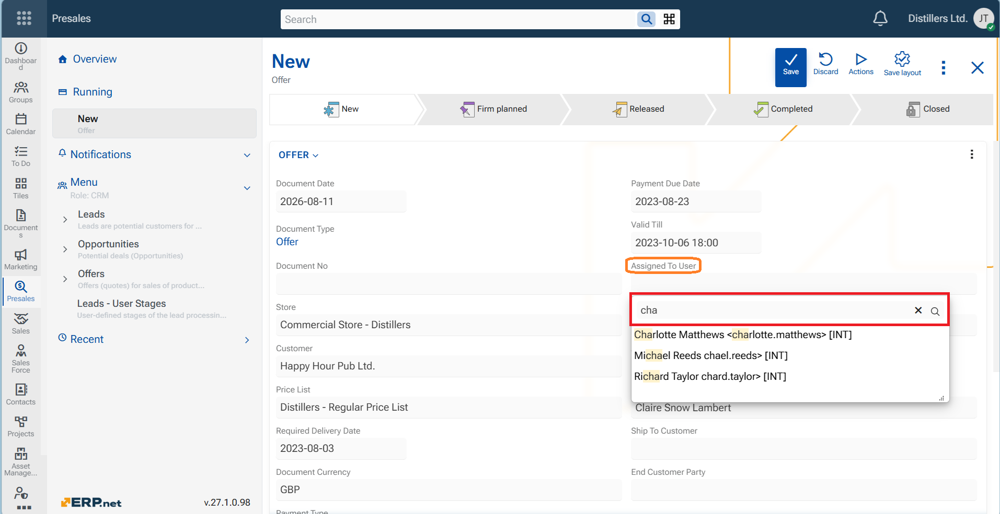

# WEB Client 

The @@webclientfull is the web-based user interface of the ERP.net business-management platform. It is one of the primary ways to access and interact with all the modules inside the ERP.net system—such as CRM, financials, inventory, production and more.

## Notable features

## Other features

### 1. Search box for all list fields

Finding values in dropdown lists is now easier. Whenever you open a dropdown list using the **chevron**, a search box is now immediately available and ready for typing. Whether you need to find a Customer, a Responsible person, or a Product, just insert some key symbols into the Search box and the results will be filtered. This improvement is available consistently throughout the Web Client, helping you find and select values faster—regardless of the list size.

