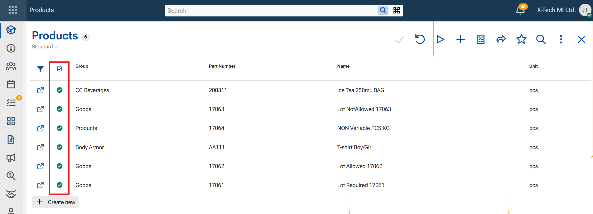

# WEB Client 

**Versions 26.3 and 27**

The @@webclientfull is the web-based user interface of the ERP.net business-management platform. It is one of the primary ways to access and interact with all the modules inside the ERP.net system—such as CRM, financials, inventory, production and more.

## Notable features

## Other features

### 1. Update records directly from the navigator

A new ["Update records" function](https://docs.erp.net/webclient/navigators/guide/update-records.html) is now available in supported navigators, allowing you to update existing records or create new ones directly from the navigator with a single command. In Desktop client this is function "Merge".

The function compares the prepared rows with existing records using the entity's **primary key**. Matching records are updated with the new values, while rows with no matching record are created as new records.

This is especially useful when copying or importing predefined data into a navigator, enabling you to apply mass changes quickly and consistently without editing records one by one.

### 2. Search box for all list fields

Finding values in dropdown lists is now easier. Whenever you open a dropdown list using the **chevron**, a search box is now immediately available and ready for typing. Whether you need to find a Customer, a Responsible person, or a Product, just insert some key symbols into the Search box and the results will be filtered. This improvement is available consistently throughout the Web Client, helping you find and select values faster—regardless of the list size.

[picture](./pictures/searchbox.png)

